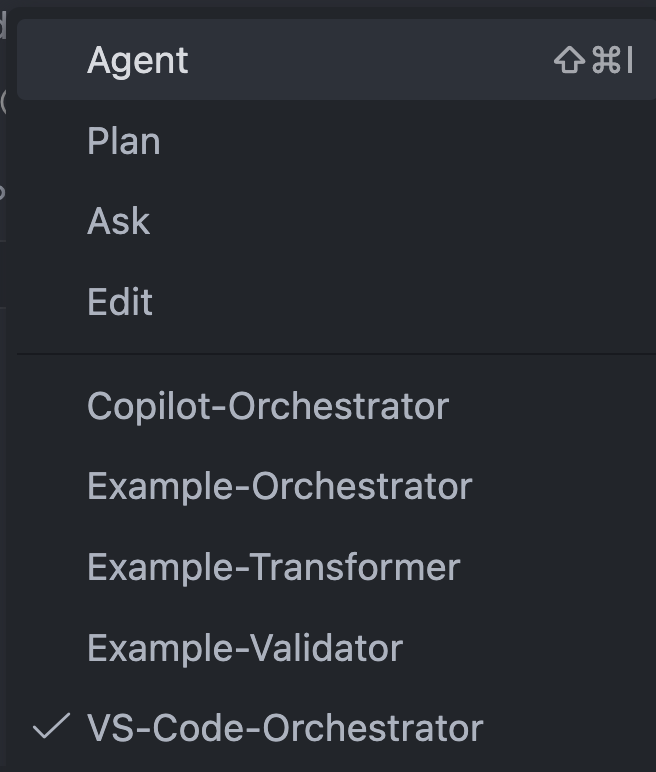
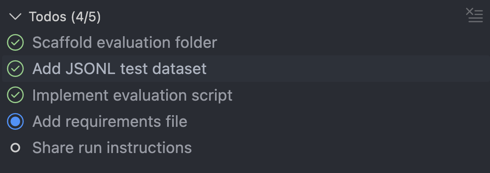

# GitHub Copilot Custom Agents - Complete Guide

> Ready-to-use syntax and patterns.

---

## 1. FILE STRUCTURE

### Three File Types

| Type          | Location                            | Purpose                        |
| ------------- | ----------------------------------- | ------------------------------ |
| **Agent**     | `.github/agents/`                   | WHAT to do (process, workflow) |
| **Tree**      | `.copilot_utils/context/trees/`     | HOW to decide (if/else logic)  |
| **Knowledge** | `.copilot_utils/context/knowledge/` | WHAT to use (reference info)   |

### Directory Layout

```
.github/agents/                    # Agent files (workflow)
    └── my-agent.agent.md
.copilot_utils/
    └── context/
        ├── trees/                 # Decision trees (if/else logic)
        │   └── project_selection.md
        └── knowledge/             # Reference knowledge
            └── anti_patterns.md
```

**Agent naming:** `lowercase-with-hyphens.agent.md`

---

## 2. CONTEXT FOLDER STRUCTURE

### The Three File Types

| File Type     | Purpose       | Contains                           |
| ------------- | ------------- | ---------------------------------- |
| **Agent**     | WHAT to do    | Process, workflow, orchestration   |
| **Tree**      | HOW to decide | If/else logic, branching decisions |
| **Knowledge** | WHAT to use   | Reference info, patterns, rules    |

### Directory Layout

```
.github/agents/              # Agent files (workflow)
.copilot_utils/
└── context/
    ├── trees/               # Decision trees (if/else logic)
    │   ├── strategy_selection.md
    │   ├── flag_selection.md
    │   └── teardown_decision.md
    └── knowledge/           # Reference knowledge
        ├── knowledge_1.md
        ├── knowledge_2.md
        └── knowledge_3.md
```

### File Naming

**Trees:** Name by the decision being made

-   `tree_1.md` - first decision type
-   `tree_2.md` - second decision type
-   `tree_3.md` - third decision type

**Knowledge:** Name by what it describes

-   `knowledge_1.md` - first topic reference
-   `knowledge_2.md` - second topic reference
-   `knowledge_3.md` - third topic reference

### How to Use in Agents

**When agent needs to make a decision:**

```markdown
**Apply tree:** `.copilot_utils/context/trees/tree_1.md`
```

**When agent needs reference information:**

```markdown
**Reference:** `.copilot_utils/context/knowledge/knowledge_1.md`
```

### Decomposition Principle

Break knowledge into small, focused files:

```
# BAD - one large file
knowledge/
└── everything.md (500 lines)

# GOOD - many small files
knowledge/
├── anti_patterns.md (50 lines)
├── setup_patterns.md (40 lines)
├── teardown_patterns.md (30 lines)
├── task_transformation.md (60 lines)
└── validation_rules.md (45 lines)
```

Create many tree files for different decisions:

```
trees/
├── tree_1.md
├── tree_2.md
├── tree_3.md
├── tree_4.md
└── tree_5.md
```

---

## 3. FRONTMATTER SYNTAX



### Required Properties

```yaml
---
name: My-Agent-Name
description: 'Brief description of agent purpose (50-150 chars)'
tools: ['read', 'edit', 'search']
model: 'Claude Sonnet 4.5'
---
```

### Full Properties Reference

| Property        | Required    | Values                            | Notes                              |
| --------------- | ----------- | --------------------------------- | ---------------------------------- |
| `name`          | Optional    | String                            | Defaults to filename               |
| `description`   | **Yes**     | `'single-quoted string'`          | 50-150 chars                       |
| `tools`         | Optional    | `['tool1', 'tool2']`              | Omit = all tools                   |
| `model`         | Recommended | `'Claude Sonnet 4.5'`, `'gpt-4o'` |                                    |
| `target`        | Optional    | `'vscode'` or `'github-copilot'`  |                                    |
| `infer`         | Optional    | `true` / `false`                  | Auto-invoke by context             |
| `argument-hint` | Optional    | String                            | Input hint for user (VS Code only) |
| `handoffs`      | Optional    | List of agent delegations         | Sub-agents to delegate to (VS Code only) |

---

## 4. TOOL ALIASES

```yaml
# Standard aliases (case-insensitive)
tools: ['read', 'edit', 'search', 'execute', 'agent', 'web', 'todo']
```

### MCP Server Tools

```yaml
tools: ['github/*']                    # All GitHub tools
tools: ['github/get_file_contents']    # Specific tool
tools: ['playwright/*']                # All Playwright tools
tools: ['my-mcp/tool-name']           # Custom MCP server
```

---

## 5. ENVIRONMENT DIFFERENCES

### VS Code vs GitHub.com

| Feature             | VS Code             | GitHub.com          |
| ------------------- | ------------------- | ------------------- |
| `model` property    | Yes                 | No                  |
| `argument-hint`     | Yes                 | No                  |
| `handoffs`          | Yes                 | No                  |
| `todo` tool         | Yes                 | No                  |
| `runSubagent`       | Yes                 | Yes                 |
| `github/*` tools    | Limited             | Full access         |
| MCP config in agent | No                  | Org/Enterprise only |
| File editing        | Interactive preview | Direct edits        |

### Target-Specific Agents

```yaml
---
name: VS-Code-Only-Agent
target: 'vscode'
tools: ['read', 'edit', 'todo'] # todo only works in VS Code
---
```

```yaml
---
name: GitHub-Agent
target: 'github-copilot'
tools: ['read', 'edit', 'github/*']
---
```

---

## 6. MCP SERVER CONFIGURATION

**MCP (Model Context Protocol)** extends agents with external tools (APIs, databases, browsers).

### Built-in Servers

```yaml
tools: ['github/*']           # GitHub tools
tools: ['playwright/*']       # Browser automation
```

### Custom MCP (Org/Enterprise Only)

```yaml
---
tools: ['read', 'my-server/*']
mcp-servers:
    my-server:
        type: 'local'
        command: 'npx'
        args: ['-y', '@org/mcp-server']
        env:
            API_KEY: ${{ secrets.API_KEY }}
---
```

### Tool Naming

```yaml
tools: ['github/*']                    # All from server
tools: ['github/get_file_contents']    # Specific tool
tools: ['server/get_data']             # Pattern: server/tool
```

### Availability

| Feature             | VS Code | GitHub.com          |
| ------------------- | ------- | ------------------- |
| `github/*`          | Limited | Full                |
| Custom MCP in agent | No      | Org/Enterprise only |
| Secrets in env      | No      | Yes                 |

---

## 7. AGENT BODY STRUCTURE

### Essential Sections

```markdown
## Role

You are a [specialist type] focused on [domain].

## Dynamic Parameters

-   **paramName**: Description of expected input

## Variable Extraction Strategy

1. **From User Input**: Parse from argument or prompt
2. **From File Context**: Use current file path
3. **Ask User**: If not provided, request it

## Return Format

**Status:** success | failed
**Output:** [what the agent returns]

## Workflow

[Phases go here]
```

---

## 8. WORKFLOW PATTERNS

### Phase Structure

```markdown
### PHASE 1: Phase Name

**Before starting:** Mark todo #1 as "in-progress"

**Steps:**

1. First action
2. Second action
3. Third action

**After completion:** Mark todo #1 as "completed"
```

### Progress Tracking (VS Code)



````markdown
## PROGRESS TRACKING

**Initial Setup:**
Call `manage_todo_list` with:

```json
{
	"operation": "write",
	"todoList": [
		{ "id": 1, "title": "First task", "status": "not-started" },
		{ "id": 2, "title": "Second task", "status": "not-started" }
	]
}
```

**During Execution:**

-   Mark task as `"in-progress"` when starting
-   Mark task as `"completed"` after finishing
````

---

## 9. VARIABLE CHAINING & DATA FLOW

### Phase-to-Phase Variable Passing

Variables flow through phases using a consistent pattern:

```markdown
### PHASE 1: Extract Data

**Input:** User provides `{inputId}`

**Steps:**

1. Fetch data from API
2. Extract fields into variables

**Output Variables:**

-   `inputId` = "12345"
-   `inputName` = "Example name"
-   `inputType` = "type_a"

---

### PHASE 2: Apply Decision

**Input:** Uses `inputType` from Phase 1

**Apply tree:** `.copilot_utils/context/trees/tree_1.md`

**Steps:**

1. Evaluate `inputType` against tree criteria
2. Set `outputPath` based on match

**Output Variables:**

-   `outputPath` = "path/to/output"
-   `configFile` = ".copilot_utils/context/knowledge/knowledge_1.md"

---

### PHASE 3: Generate Output

**Input:** Uses `outputPath`, `inputId`, `inputName` from previous phases

**Steps:**

1. Construct file path: `${outputPath}/${inputId}.py`
2. Use `inputName` for description

**Output:**

-   Created file at computed path
```

### Sub-Agent Input/Output Chaining

```javascript
// Phase 1: Analyze → returns analysisResult
const analysisResult = await runSubagent({
	description: 'Analyze input data',
	prompt: `You are the Analyzer.

Input:
- Id: ${inputId}
- Data: ${inputData}

Task:
1. Parse input
2. Identify components
3. Return findings

Return JSON:
{ "items": ["item1", "item2"], "type": "type_a" }`,
});

// Phase 2: Transform → uses analysisResult
const transformResult = await runSubagent({
	description: 'Transform data',
	prompt: `You are the Transformer.

Input from previous phase:
- Items: ${analysisResult.items}
- Type: ${analysisResult.type}

Reference: .copilot_utils/context/knowledge/knowledge_1.md

Task:
1. Apply transformation rules
2. Generate output

Return JSON:
{ "output": ["result here"] }`,
});

// Phase 3: Generate → uses transformResult
const generateResult = await runSubagent({
	description: 'Generate file',
	prompt: `You are the Generator.

Input:
- Id: ${inputId}
- Output: ${transformResult.output}

Task:
1. Create file at ${filePath}

Return: File path created`,
});
```

### Variable Syntax

**Declaration in agent:**

```markdown
## Dynamic Parameters

-   **projectName**: Name of the project
-   **basePath**: Root directory path
-   **outputDir**: Where to write results
```

**Usage in prompts:**

```markdown
Process **${projectName}** at `${basePath}`. Write to `${outputDir}/`.
```

**Passing to sub-agents:**

```javascript
prompt: `You are the Processor.
Project: ${projectName}
Input: ${basePath}/input/
Output: ${outputDir}/`;
```

**Key rules:**

-   Use `${variableName}` syntax
-   camelCase naming: `projectName`, `basePath`
-   Variables resolved before sending to sub-agent

---

## 10. SUB-AGENT ORCHESTRATION

### Orchestrator Pattern

Orchestrators delegate work to specialized sub-agents:

```
Orchestrator → (FILE_PATH + expectations) → Sub-Agent
Sub-Agent → (structured result) → Orchestrator
```

**Key Concept:** Orchestrator doesn't do the work itself. It:

1. Gathers context and determines what needs to be done
2. Delegates specific tasks to sub-agents with clear inputs
3. Collects structured results from sub-agents
4. Coordinates the overall workflow

---

### VS Code: `handoffs` Syntax

Use `handoffs` in frontmatter to define sub-agents:

```yaml
---
name: VS-Code-Orchestrator
description: 'Orchestrates validation workflow'
tools: ['read', 'edit', 'search', 'agent', 'todo']
model: 'Claude Sonnet 4.5'
target: 'vscode'
handoffs:
    - label: 'Validate File'
      agent: 'Validator-Agent'
      prompt: 'Analyze this file for anti-patterns and return violations'
    - label: 'Transform File'
      agent: 'Transformer-Agent'
      prompt: 'Apply fixes for the violations found'
    - label: 'Generate Report'
      agent: 'Reporter-Agent'
      prompt: 'Create summary report of all changes'
---
```

**Handoffs Properties:**

| Property | Required | Description |
|----------|----------|-------------|
| `label` | Yes | Button label shown to user |
| `agent` | Yes | Agent name to delegate to |
| `prompt` | Yes | Instructions passed to sub-agent |

**Delegation in workflow:**

```markdown
### PHASE 2: Validate

**Delegate to:** `Validator-Agent` via handoff

**Input:**

-   File: `${filePath}`
-   Rules: `.copilot_utils/context/knowledge/knowledge_1.md`

**Expected return:**

-   status: PASS | FAIL
-   violations: list with line numbers

**On PASS:** Continue to Phase 3
**On FAIL:** Stop and report violations
```

---

### GitHub Copilot: `runSubagent` Syntax

Use `runSubagent()` for inline sub-agent calls:

```javascript
// Delegate to analyzer sub-agent
const analysisResult = await runSubagent({
	description: 'Analyze file for patterns',
	prompt: `You are the Analyzer.

**Input:**
- File: ${filePath}
- Reference: .copilot_utils/context/knowledge/knowledge_1.md

**Task:**
1. Read the file at ${filePath}
2. Read the reference patterns
3. Identify all pattern matches

**Return JSON:**
{
    "patterns": ["pattern1", "pattern2"],
    "lineNumbers": [10, 25, 42],
    "suggestions": ["fix1", "fix2"]
}`,
});

// Delegate to transformer sub-agent (uses result from analyzer)
const transformResult = await runSubagent({
	description: 'Apply transformations',
	prompt: `You are the Transformer.

**Input from Analyzer:**
- Patterns: ${analysisResult.patterns}
- Lines: ${analysisResult.lineNumbers}

**Task:**
1. Apply fixes at specified lines
2. Write updated file

**Return JSON:**
{
    "status": "success",
    "filesModified": ["path/to/file.py"],
    "changesApplied": 3
}`,
});
```

---

### Key Rules

1. **Orchestrator provides context** - FILE_PATH + expectations for each sub-agent
2. **Sub-agents return structured data** - JSON or defined format back to orchestrator
3. **Parent tools limit child** - Sub-agents can't use tools parent doesn't have
4. **Keep sub-agents focused** - One clear task per sub-agent
5. **Chain results** - Pass output from one sub-agent as input to next
6. **Limit scale** - Max 5-10 sequential sub-agent calls

### Sub-Agent Response Format

Define what each sub-agent must return:

````markdown
**Expected return:**

```json
{
    "status": "PASS | FAIL",
    "data": { ... },
    "errors": []
}
```
````

````

### Error Handling in Orchestration

```markdown
**Delegate to:** `validator`

**Input:** File at `${filePath}`

**On success:** Continue to next phase
**On failure:**
1. Log the error from sub-agent response
2. Attempt recovery or stop workflow
3. Report final status to user
````

---

## 11. REFERENCING CONTEXT FILES

### Two Reference Types

| When to Use                | Syntax            | Example                               |
| -------------------------- | ----------------- | ------------------------------------- |
| Need to make a decision    | `**Apply tree:**` | Choosing project, selecting scaffolds |
| Need reference information | `**Reference:**`  | Anti-patterns, code patterns          |

### Apply Tree (for decisions)

Use when agent needs to make if/else decisions:

```markdown
### PHASE 2: Make Decision

**Apply tree:** `.copilot_utils/context/trees/tree_1.md`

**Steps:**

1. Evaluate `{inputType}` against tree criteria
2. Set `outputPath` variable based on match
```

### Reference (for knowledge)

Use when agent needs reference information:

```markdown
### PHASE 3: Validate

**Reference:** `.copilot_utils/context/knowledge/knowledge_1.md`

**Steps:**

1. Check output against each rule listed
2. Report any issues found
```

### Multiple References

```markdown
**Reference:**

-   `.copilot_utils/context/knowledge/knowledge_1.md`
-   `.copilot_utils/context/knowledge/knowledge_2.md`
```

### Reference with Mapping

When different inputs need different knowledge files:

```markdown
**Reference mapping:**

inputType → Knowledge File:
├─ type_a → .copilot_utils/context/knowledge/knowledge_1.md
├─ type_b → .copilot_utils/context/knowledge/knowledge_2.md
└─ type_c → .copilot_utils/context/knowledge/knowledge_3.md
```

### Delegate to Sub-Agent with References

```javascript
const validation = await runSubagent({
	description: 'Validate against anti-patterns',
	prompt: `You are the Validator.

File: ${filePath}

Reference: .copilot_utils/context/knowledge/anti_patterns.md

Task:
1. Read the reference file
2. Check file against each pattern
3. Report violations

Return: PASS | FAIL with list`,
});
```

### Syntax Summary

| Use Case              | Syntax                                  |
| --------------------- | --------------------------------------- |
| Decision needed       | `**Apply tree:** path/to/tree.md`       |
| Knowledge needed      | `**Reference:** path/to/knowledge.md`   |
| Multiple files        | `**Reference:**` + bullet list          |
| Conditional reference | `**Reference mapping:**` + tree diagram |

---

## 12. DECISION TREES

### Decision Tree Syntax

```markdown
## Decision Tree Name

Input condition:
├─ "pattern-a", "keyword-a"
│ → result_a/
├─ "pattern-b", "keyword-b"
│ → result_b/
└─ Unknown
→ Use semantic_search() to determine

**Output:** `VARIABLE_NAME` (e.g., `result_a`)
```

### Complete Decision Tree Example

```markdown
## Selection Decision Tree

Use input data to determine output path:

Input contains:
├─ "keyword_a", "type_a"
│ → path/option_a/
├─ "keyword_b", "type_b"
│ → path/option_b/
├─ "keyword_c", "type_c"
│ → path/option_c/
└─ Unknown
→ Use default or ask user

**Output:** `OUTPUT_PATH` variable (e.g., `option_a`)
```

**Knowledge Mapping:**

Once option is identified, read the corresponding knowledge:

```

Option Identified → Read Knowledge:
├─ option_a → .copilot_utils/context/knowledge/knowledge_1.md
├─ option_b → .copilot_utils/context/knowledge/knowledge_2.md
└─ option_c → .copilot_utils/context/knowledge/knowledge_3.md

```

### Using Decision Trees in Workflow

```markdown
### PHASE 2: Apply Decision Tree

**Before starting:** Mark todo #2 as "in-progress"

**Apply tree:** `.copilot_utils/context/trees/tree_1.md`

**Steps:**

1. Evaluate input against decision tree criteria
2. Match to pattern (option_a, option_b, option_c)
3. Set `outputPath` variable
4. Read the corresponding knowledge file per mapping

**After completion:** Mark todo #2 as "completed"
```

---

## 13. EXECUTE TOOL - TERMINAL COMMANDS

### Terminal Command Syntax in Agent

````markdown
## Workflow

### Phase 1: Run Validation Script

**Execute command:**

```bash
poetry run python scripts/validate_test.py {filePath}
```

**Expected output:**

-   Exit code 0: Validation passed
-   Exit code 1: Validation failed with errors

**On success:** Continue to next phase
**On failure:** Read error output and fix issues
````

### Running Scripts with Parameters

````markdown
### Phase: Fetch Data

**Execute command:**

```bash
python scripts/fetch_data.py {inputId}
```

**Output file:** `output/{inputId}.json`

**Next step:** Read the output file to extract data
````

### Running Code Directly

````markdown
### Phase: Verify Installation

**Execute command:**

```bash
node -e "console.log(require('./package.json').version)"
```

**Purpose:** Check package version without reading file

---

**Execute command:**

```bash
python -c "from src.helpers import scaffold; print(scaffold.__file__)"
```

**Purpose:** Verify module location
````

### Structured Output

```markdown
## Output Format

For each item found:

### [Icon] [Item Name]

**Line:** [line number]
**Issue:** [description]
**Current:** `"[current value]"`
**Suggested:** `"[fixed value]"`
```

````markdown
### Completion Report

## Return Format

Upon completion, return:

```markdown
**Task Completed**

-   **Status**: success | failed
-   **File Path**: `path/to/output`
-   **Summary**: Brief description
-   **Validations**: [checkmarks for each validation]
```
````

---

## 15. BEST PRACTICES

### Core Separation Principle

| File Type     | Contains                | Example                                          |
| ------------- | ----------------------- | ------------------------------------------------ |
| **Agent**     | WHAT to do (process)    | "Read file, apply tree, validate, create output" |
| **Tree**      | HOW to decide (logic)   | "If label contains X → use path Y"               |
| **Knowledge** | WHAT to use (reference) | "Available scaffolds: A, B, C"                   |

### DO

-   **Reference knowledge, don't embed it** - Agent says "Reference: file.md", not copy-paste content
-   **Decompose everything** - Many small files, not one large file
-   **Create many trees** - Separate tree for each decision type
-   **Keep agents focused** - Workflow orchestration only
-   **Use minimal tools** - Principle of least privilege
-   **Document variables** - Clear extraction strategy
-   **Phase markers** - "Before starting" / "After completion"
-   **Progress tracking** - Use todo list for multi-step workflows
-   **Clear output format** - Define what agent returns

### DON'T

-   Embed knowledge in agent (reference it instead)
-   Put examples in agent (put in knowledge files)
-   Create one large knowledge file (decompose into many small files)
-   Mix decision logic with knowledge (separate into trees vs knowledge)
-   Grant excessive tool access
-   Use vague instructions ("improve", "optimize")
-   Skip variable validation
-   Use `runSubagent` for bulk processing (>10 steps)

### Anti-Pattern Lists in Knowledge Files

Don't put "bad examples" with full code. Instead, list patterns to identify:

```markdown
# anti_patterns.md

## Patterns to Identify

1. **Vague verbs** - Look for: "Choose", "Select", "Enter"

    - Should be: "Click", "Fill", "Verify"

2. **Combined actions** - Look for: "and", "then" in single task

    - Should be: Split into separate tasks

3. **Missing quotes** - Look for: unquoted element names

    - Should be: `"element name"` with quotes

4. **Generic identifiers** - Look for: "the button", "the field"
    - Should be: Specific text or locator
```

---

## 16. COMMON PATTERNS

### Validator Agent

```yaml
---
name: Code-Validator
description: 'Validates code against defined patterns and anti-patterns'
tools: ['read', 'search']
model: 'Claude Sonnet 4.5'
---

## Role
You validate code against known patterns.

## Dynamic Parameters
- **filePaths**: Path(s) to files to analyze

## Workflow

### Phase 1: Load Rules
Read validation rules from `.copilot_utils/context/rules/`

### Phase 2: Analyze
Check each file against loaded rules

### Phase 3: Report
Generate violation report

## Return Format
**Status:** PASS | FAIL
**Violations:** List with line numbers
```

### Anti-Pattern Checker Agent

```yaml
---
name: Anti-Pattern-Checker
description: 'Validates code against anti-patterns that cause failures'
tools: ['read', 'search']
model: 'Claude Sonnet 4.5'
---

## Role
You validate code against known anti-patterns.

## Dynamic Parameters
- **filePaths**: Path(s) to the file(s) to analyze

## Variable Extraction Strategy
1. **From Orchestrator Prompt**: Extract file paths passed in delegation
2. **From User Prompt**: Look for explicit file path mentions
3. **From File Context**: Use current open file if applicable
4. **Ask User**: If not provided, request the file path

## Reference Documentation

**Before checking code, always read:**
1. `.copilot_utils/context/standards/ANTI_PATTERNS_CHECKLIST.md`
2. `.copilot_utils/context/standards/anti_patterns/*.md`

## Workflow

### Phase 1: Load Documentation
Read all anti-pattern reference documentation

### Phase 2: Analyze File
Check each section against all documented anti-patterns

### Phase 3: Report Violations
Generate the output report

## Output Format

For each violation found:


### [Anti-Pattern Name]

**Line:** [line number]
**Issue:** [description of the problem]
**Current:** `"[current code]"`
**Suggested:** `"[corrected code]"`


## Return Format
**Status:** PASS | FAIL
**Violation Count:** Number of anti-patterns found
**Issues:** List each violation with line number and suggested fix
```

### Orchestrator Agent (VS Code with handoffs)

```yaml
---
name: VS-Code-Orchestrator
description: 'Orchestrates workflow with sub-agent delegation'
tools: ['read', 'edit', 'search', 'agent', 'todo']
model: 'Claude Sonnet 4.5'
target: 'vscode'
handoffs:
    - label: 'Analyze File'
      agent: 'Analyzer-Agent'
      prompt: 'Analyze this file and return findings'
    - label: 'Transform File'
      agent: 'Transformer-Agent'
      prompt: 'Apply transformations based on analysis'
---

## Role
You orchestrate by delegating to sub-agents.

## Workflow

### PHASE 1: Gather Context
Read file, prepare context for sub-agents.

### PHASE 2: Delegate Analysis
**Delegate to:** `Analyzer-Agent` via handoff
**Input:** File path + reference
**Expected return:** { status, violations }

### PHASE 3: Delegate Transformation
**Delegate to:** `Transformer-Agent` via handoff
**Input:** File path + violations from Phase 2
**Expected return:** { status, changesApplied }

## Return Format
Status + summary of sub-agent results
```

### Orchestrator Agent (GitHub Copilot with runSubagent)

````yaml
---
name: Copilot-Orchestrator
description: 'Orchestrates workflow using runSubagent'
tools: ['read', 'edit', 'search', 'agent']
target: 'github-copilot'
---

## Role
You orchestrate by calling runSubagent.

## Workflow

### PHASE 1: Gather Context
Read file, prepare context.

### PHASE 2: Delegate Analysis
```javascript
const result = await runSubagent({
    description: 'Analyze file',
    prompt: `File: ${filePath}
Reference: .copilot-utils/context/knowledge/knowledge_1.md
Return JSON: { status, violations }`
});
````

### PHASE 3: Delegate Transformation

Pass result.violations to next sub-agent.

## Return Format

Status + summary

````

### Reviewer Agent

```yaml
---
name: Architecture-Reviewer
description: 'Reviews files against best practices'
tools: ['read', 'search']
model: 'Claude Sonnet 4.5'
---

## Role
You review files against best practices.

## Checklist
- [ ] Item 1
- [ ] Item 2

## Output Format
### Scores
1. **Category A:** X/100
2. **Category B:** X/100

### Issues Found
**Priority:** High / Medium / Low
**Location:** Line X
**Issue:** Description
**Fix:** Recommendation
````

---

## 17. QUICK REFERENCE

### Minimal Agent Template

```yaml
---
description: 'What this agent does'
tools: ['read', 'search']
model: 'Claude Sonnet 4.5'
---

## Role
You are a [role] specialist.

## Task
[What to do]

## Output
[What to return]
```

### Full Orchestrator Template (VS Code)

```yaml
---
name: Full-Orchestrator
description: 'Complete orchestration with sub-agent delegation'
tools: ['read', 'edit', 'search', 'agent', 'todo']
model: 'Claude Sonnet 4.5'
target: 'vscode'
argument-hint: 'Provide the input parameter'
handoffs:
    - label: 'Analyze File'
      agent: 'Analyzer-Agent'
      prompt: 'Analyze this file for patterns and issues'
    - label: 'Transform File'
      agent: 'Transformer-Agent'
      prompt: 'Apply fixes based on analysis results'
---

## Role
You orchestrate by delegating to specialized sub-agents.

## Dynamic Parameters
- **filePath**: Path to process

## PROGRESS TRACKING
[todo setup]

## Workflow

### PHASE 1: Gather Context
**Before starting:** Mark todo #1 as "in-progress"

**Steps:**
1. Read file at `${filePath}`
2. Prepare context for sub-agents

**After completion:** Mark todo #1 as "completed"

### PHASE 2: Delegate Analysis
**Before starting:** Mark todo #2 as "in-progress"

**Delegate to:** `Analyzer-Agent` via handoff

**Input:**
- File: `${filePath}`
- Reference: `.copilot_utils/context/knowledge/knowledge_1.md`

**Expected return:**
{ "status": "PASS|FAIL", "violations": [...] }

**After completion:** Mark todo #2 as "completed"

### PHASE 3: Delegate Transformation
**Before starting:** Mark todo #3 as "in-progress"

**Delegate to:** `Transformer-Agent` via handoff

**Input:**
- File: `${filePath}`
- Violations: `${analysisResult.violations}`

**Expected return:**
{ "status": "success", "changesApplied": N }

**After completion:** Mark todo #3 as "completed"

## Error Handling
- **Sub-agent failure**: Log error, report partial results
- **Invalid input**: Ask user for correct path

## Return Format
**Status:** success | failed
**Analysis:** Sub-agent result summary
**Transformations:** Changes applied count
```

---

## 18. CHECKLIST

### Before Deploying Agent

**Frontmatter:**

-   [ ] `description` present, single-quoted, 50-150 chars
-   [ ] `tools` minimal and necessary
-   [ ] `model` specified
-   [ ] `target` set if environment-specific

**Structure:**

-   [ ] Clear role definition
-   [ ] Variable extraction documented
-   [ ] Phases have before/after markers
-   [ ] Input/Output variables defined per phase
-   [ ] Output format defined
-   [ ] Error handling included

**Context Files:**

-   [ ] Trees in `.copilot_utils/context/trees/` (decision logic)
-   [ ] Knowledge in `.copilot_utils/context/knowledge/` (reference info)
-   [ ] Each file is small and focused (decomposed)
-   [ ] Separate tree for each decision type

**Separation:**

-   [ ] Agent contains ONLY workflow (what to do)
-   [ ] Trees contain ONLY decision logic (how to decide)
-   [ ] Knowledge contains ONLY reference info (what to use)
-   [ ] No embedded examples in agent (reference knowledge files)
-   [ ] No embedded decision logic in agent (apply trees)

**References:**

-   [ ] Uses `**Apply tree:**` for decisions
-   [ ] Uses `**Reference:**` for knowledge
-   [ ] File paths are complete and correct

**Architecture:**

-   [ ] Agent focuses on workflow only
-   [ ] Sub-agents have clear, focused tasks
-   [ ] Variables passed correctly between phases
-   [ ] Variables passed correctly to sub-agents

**Quality:**

-   [ ] Under 30,000 characters
-   [ ] No empty sections
-   [ ] Instructions are actionable (imperative mood)
-   [ ] Tested with representative inputs

---

Made with ❤️ at [endorphinai.dev](https://endorphinai.dev/)
